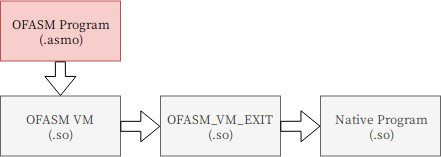
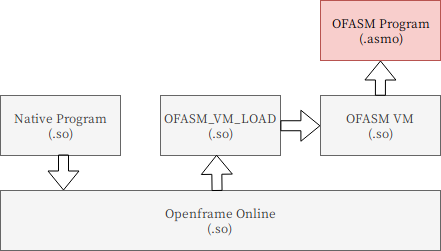

# Chapter: OFASM interface

This chapter covers the definition of the OFASM interface and how to create it on different situations.  

## Section 1. Definition of OFASM interface

OFASM binary has it's own binary format (.asmo) and therefore is not compatible with the linux native binary (.so). Due to this fact, it is impossible to directly call or load between programs which are in OFASM binary format and native binary format.  

To make the call or load happen, we need the OFASM interface.

There are three different types of OFASM interface

1. OFASM_VM_ENTRY  
  
    - OFASM_VM_ENTRY interface enables the call from native program to OFASM program.  

        
        
    - Naming conventions of OFASM_VM_ENTRY
        - cpp naming convension: PGM_OFASM_VM_ENTRY.cpp
        - so naming convension : PGM.so  

1. OFASM_VM_EXIT
    - OFASM_VM_EXIT interface supports the call from OFASM program to native program.  

           
        
    - Naming conventions of OFASM_VM_EXIT
        - cpp naming convension: PGM_OFASM_VM_EXIT.cpp
        - so naming convension : PGM_OFASM_VM_EXIT.so  


2. OFASM_VM_LOAD
    - OFASM_VM_LOAD interface is for EXEC CICS LOAD command used in native program.  
    
        
    
    - Naming conventions of OFASM_VM_LOAD
        - cpp naming convension: PGM_OFASM_VM_LOAD.cpp
        - so naming convension : PGM_OFASM_VM_LOAD.so  

    - **Please note that the program must be defined as ASSEMBLER in the online SD (System Definition) to use OFASM_VM_LOAD interface.**

## Section 2. OFASM interface implementation

This section demonstrate how to implement the OFASM interface.

### 1. OFASM_VM_ENTRY

OFASM_VM_ENTRY interface supports static and dynamic parameter list.  

1.1 Static parameter list (fixed parameter list)

For static parameter list, the parameter information gets fixed in compile time.
In this case, you need to manually define the number of the paremeters and length of the each parameter.

example)
```cpp
#include <stdlib.h>
#include <string.h>
#include <arpa/inet.h>

struct ofasm_param
{
    long long length;
    long long elemCnt;
    char *addr;
    char *elemListAddr;
};

extern int OFASM_VM_ENTRY(const char *progName, ofasm_param param[], int paramCnt); // DEPRECATED
extern int OFASM_VM_ENTRY(const char *progName, const char *entryName, ofasm_param param[], int paramCnt);

extern "C"
{

extern int ofcom_call_parm_get(int index, char* func_name, int *count, int **size_list);

/** @fn       int PGM(char *p0)
*   @brief    Enter OFASM VM entry method
*   @details  Make up ofasm parameters and then enter OFASM VM entry using entry name
*   @params   p0 0th parameter in PLIST
*/
int PGM(char *p0)
{
    /* declare local arguments */
    int rc;
    int paramCnt;
    ofasm_param param[1];

    /* set params */
    param[0].length = 30;
    param[0].addr = p0;
    param[0].elemListAddr = NULL;
    param[0].elemCnt = 0;

    /* set param count */
    paramCnt = 1;

    /* call VM */
    rc = OFASM_VM_ENTRY("PGM", "PGM", param, paramCnt);
    return rc;
}

}
```

1.2 Dynamic parameter list (variable parameter list)

The dynamic parameter list set the parameters at runtime based on the caller's call statement.
This feature can be used only when '--enable-ofasm' is used in OFCOBOL or OFPLI.

```cpp
#include <stdlib.h>
#include <string.h>
#include <arpa/inet.h>

struct ofasm_param
{
    long long length;
    long long elemCnt;
    char *addr;
    char *elemListAddr;
};

extern int OFASM_VM_ENTRY(const char *progName, ofasm_param param[], int paramCnt); // DEPRECATED
extern int OFASM_VM_ENTRY(const char *progName, const char *entryName, ofasm_param param[], int paramCnt);

extern "C"
{

extern int ofcom_call_parm_get(int index, char* func_name, int *count, int **size_list);

/** @fn       int PGM()
*   @brief    Enter OFASM VM entry method
*   @details  Make up ofasm parameters and then enter OFASM VM entry using entry name
*/
int PGM()
{
    /* declare local arguments */
    int rc;
    int paramCnt;
    char prgName[64] = {0};
    int *sizeList;
    ofasm_param param[0];

    /* set params */
    /* set param count */
    paramCnt = 0;

    /* call VM */
    rc = OFASM_VM_ENTRY("PGM", "PGM", param, paramCnt);
    return rc;
}

}
```

### 2. OFASM_VM_EXIT

Specify the number of parameters being passed to the native program.

example)
```cpp
#include <stdlib.h>
#include <string.h>
#include <arpa/inet.h>

extern "C"
{

extern int PGM(char* p0);

int PGM_OFASM_VM_EXIT(char* p0)
{
    /* call VM */
    int rc = PGM(p0);
    return rc;
}

}
```

### 3. OFASM_VM_LOAD

OFASM_VM_LOAD will require two function to be implemented.

3.1 PGM_OFASM_VM_LOAD_SIZE
    - This function is intended to return the byte size of the loaded asm program.
    
3.2 PGM_OFASM_VM_LOAD_COPY
    - This function is intended the loaded assembler program into native memory.

example)
```cpp
#include <stdlib.h>
#include <string.h>
#include <arpa/inet.h>
#include <stdio.h>

extern "C"
{

int PGM_OFASM_VM_LOAD_SIZE(int asm_size)
{    
    return asm_size;
}

int PGM_OFASM_VM_LOAD_COPY(char *asm_ptr, char *cob_ptr, int asm_size)
{
    memcpy(cob_ptr, asm_ptr, asm_size);
    return 0;
}

}
```

## Section 3. Handling pointer type variables in the OFASM interface

Handling pointer type variable in OFASM interface can be very tricky.
Since the OFASM VM uses it's own virtualized memory, you need to convert the address value when

## Section 4. Using ofasmif to generate OFASM interface

You can automatically generate OFASM_VM_ENTRY interface using ofasmif tool.  
ofasmif require JSON formatted input which describes the interface.
For more information, please refer to Chapter 2. Assembler Interface Development on OpenFrame_ASM_4_User_Guide_v2.1.2_en.pdf manual.

## Section 5. Examples

### Example1. Native -> OFASM -> Native call

https://github.com/tmaxsoft-us/ofasm/tree/master/sample/CALL

