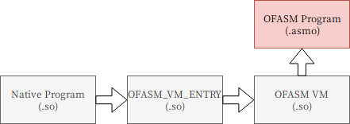

t
# Chapter: OFASM interface

This chapter covers the definition of the OFASM interface and how to create and use the OFASM interface for multiple different situations.  

## Section 1. Definition of OFASM interface

OFASM binary has it's own binary format (.asmo) and therefore is not compatible with the linux native binary (.so). Due to this fact, it is impossible to directly call or load between programs which are in OFASM binary format and native binary format.  

To make the call or load happen, we need the OFASM interface.

There are three different types of OFASM interface

1. OFASM_VM_ENTRY  
  
    - OFASM_VM_ENTRY interface enables the call from native program to OFASM program.  

        

1. OFASM_VM_EXIT
    - OFASM_VM_EXIT interface supports the call from OFASM program to native program.  

        

2. OFASM_VM_LOAD
    - OFASM_VM_LOAD interface is for EXEC CICS LOAD command used in native program.  
    - Please note that the program must be defined as ASSEMBLER in the online SD (System Definition) to use OFASM_VM_LOAD interface.

        

## Section 2. OFASM interface Implementation

### 1. OFASM_VM_ENTRY

- cpp naming convension: PGM_OFASM_VM_ENTRY.cpp
- so naming convension : PGM.so  

example)
```cpp
#include <stdlib.h>
#include <string.h>
#include <arpa/inet.h>

struct ofasm_param
{
    long long length;
    long long elemCnt;
    char *addr;
    char *elemListAddr;
};

extern int OFASM_VM_ENTRY(const char *progName, ofasm_param param[], int paramCnt); // DEPRECATED
extern int OFASM_VM_ENTRY(const char *progName, const char *entryName, ofasm_param param[], int paramCnt);

extern "C"
{

extern int ofcom_call_parm_get(int index, char* func_name, int *count, int **size_list);

/** @fn       int PGM(char *p0)
*   @brief    Enter OFASM VM entry method
*   @details  Make up ofasm parameters and then enter OFASM VM entry using entry name
*   @params   p0 0th parameter in PLIST
*/
int PGM(char *p0)
{
    /* declare local arguments */
    int rc;
    int paramCnt;
    ofasm_param param[1];

    /* set params */
    param[0].length = 30;
    param[0].addr = p0;
    param[0].elemListAddr = NULL;
    param[0].elemCnt = 0;

    /* set param count */
    paramCnt = 1;

    /* call VM */
    rc = OFASM_VM_ENTRY("PGM", "PGM", param, paramCnt);
    return rc;
}

}
```

### 2. OFASM_VM_EXIT

- cpp naming convension: PGM_OFASM_VM_EXIT.cpp
- so naming convension : PGM_OFASM_VM_EXIT.so  

example)
```cpp
#include <stdlib.h>
#include <string.h>
#include <arpa/inet.h>

extern "C"
{

extern int PGM(char* p0);

int PGM_OFASM_VM_EXIT(char* p0)
{
    /* call VM */
    int rc = PGM(p0);
    return rc;
}

}
```

### 3. OFASM_VM_LOAD

- cpp naming convension: PGM_OFASM_VM_LOAD.cpp
- so naming convension : PGM_OFASM_VM_LOAD.so  

example)
```cpp
#include <stdlib.h>
#include <string.h>
#include <arpa/inet.h>
#include <stdio.h>

extern "C"
{

/**
 ** @brief PGM_OFASM_VM_LOAD_SIZE adjust size of native memory
           since the pointer size is 8 bytes in native system while the assembler is 4 bytes
 ** @return byte size of PGM in native system view
 **/
int PGM_OFASM_VM_LOAD_SIZE(int asm_size)
{
    int ptr_cnt = 0;
    return asm_size + ( (sizeof(char*) - 4) * ptr_cnt );
}

/**
 ** @brief PGM_OFASM_VM_LOAD_COPY
 ** @param asm_ptr address of PGM assembler
 ** @param cob_ptr address of PGM cobol
 ** @param asm_size byte size of PGM.asm
 ** @return 0: success, -1: error
 **/
int PGM_OFASM_VM_LOAD_COPY(char *asm_ptr, char *cob_ptr, int asm_size)
{
    memcpy(cob_ptr, asm_ptr, asm_size);
    return 0;
}

}
```


## Section 3. Using ofasmif to generate OFASM interface

You can generate OFASM_VM_ENTRY interface using ofasmif tool.  
This is explained in Chapter 2. Assembler Interface Development on OpenFrame_ASM_4_User_Guide_v2.1.2_en.pdf manual.

## Section 4. Examples

### Example1. Native -> OFASM -> Native call

https://github.com/tmaxsoft-us/ofasm/tree/master/sample/CALL

